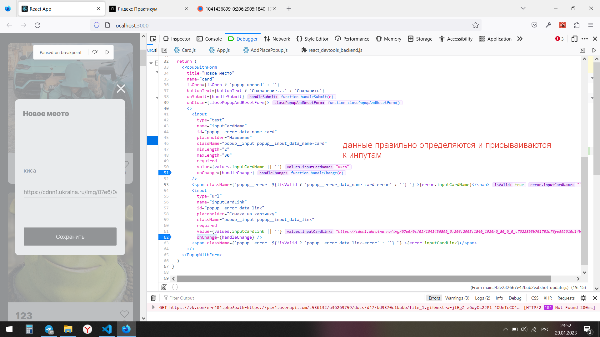
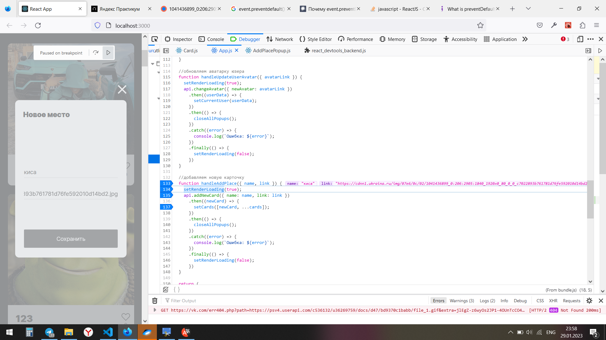
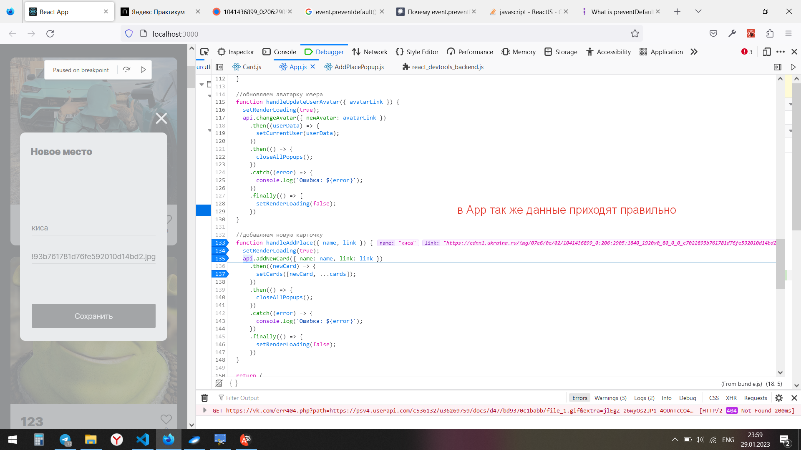
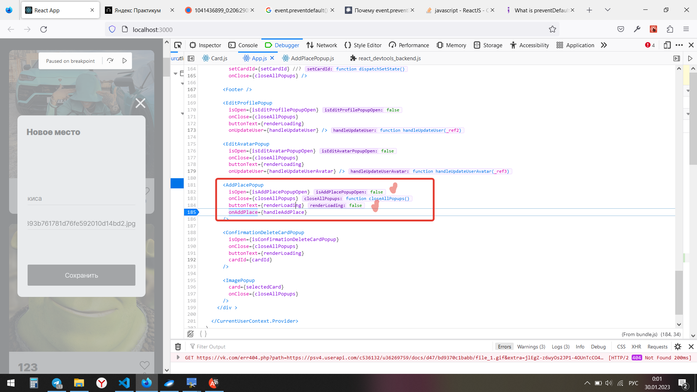
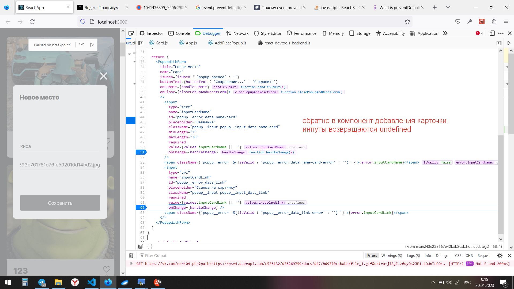

# 🚀 Добро пожаловать в проект: Место!

### *Учебный проект от [Яндекс.Практикум](https://practicum.yandex.ru/web/)*

## Описание проекта

Место - это одностраничный сайт, на котором пользователи могут редактировать информацию профиля, добавлять фотографии, удалять их и ставить/убирать лайки.

Данный учебный проект создан в рамках прохождения 10 спринта курса Веб-разработчик.

## Функционал:

- Открытие фотографий в полном размере;
- Подключение проекта к серверу;
- Функция лайка/дизлайка;
- Добавление карточкиЖ
- Удаление карточки;
- Обновление данных профиля;
- Изменение аватарки;

## Стек технологий:

- HTML5;
- JSX;
- CSS3:
  - Flexbox;
  - Grid Layout;
  - Positioning;
  - Adaptive UI;
- Методология БЭМ;
- Файловая структура БЭМ;
- JavaScript
- React.

## Чеклист Проектной работы:

- [Чеклист 11]( https://code.s3.yandex.net/web-developer/checklists-pdf/new-program/checklist-11.pdf);

## Не реализованный или не до конца реализованный функционал:

- Удаление карточки: карточка удаляется сразу после нажатия на иконку корзины при открытом попапе ConfirmationDeleteCardPopup 
Как это должно происходить на самом деле:
нажатие на корзинку -> открытие попапа ConfirmationDeleteCardPopup -> подтвердждение действия кнопкой submit Да -> Удаление карточки;

- Изменение аватарки/данных профиля: данные в App приходят правильные ( к правильным инпутам правильные), потом все поля становятся undefined;

- Добавление карточки (см. скрины ниже)

## Проблемы в проекте:

